# 🗄️ Firestore Database Schema Design - ICuisine
## 📦 Firestore Data Reading & Real-Time UI

### Project Title: Firestore Data Integration in ICuisine

This project demonstrates how to read data from Firestore collections and documents in a Flutter app using the `cloud_firestore` package. The app connects to Firestore, fetches data, and displays it dynamically in the UI, updating instantly when Firestore data changes.

---

## 🔗 Firestore Read Operations

### 1. Collection Read (All Documents)
```dart
final snapshot = await FirebaseFirestore.instance
    .collection('products')
    .get();
for (var doc in snapshot.docs) {
  print(doc.data());
}
```

### 2. Document Read (Single Document)
```dart
final doc = await FirebaseFirestore.instance
    .collection('users')
    .doc('userId')
    .get();
print(doc.data());
```

### 3. Real-Time Stream (Recommended)
```dart
FirebaseFirestore.instance
  .collection('tasks')
  .snapshots()
```

### 4. Query with Filters
```dart
FirebaseFirestore.instance
  .collection('orders')
  .where('status', isEqualTo: 'pending')
  .snapshots();
```

---

## 🖥️ Displaying Data in UI

### StreamBuilder (Real-Time Updates)
```dart
StreamBuilder(
  stream: FirebaseFirestore.instance.collection('tasks').snapshots(),
  builder: (context, snapshot) {
    if (!snapshot.hasData) return CircularProgressIndicator();
    final tasks = snapshot.data!.docs;
    return ListView.builder(
      itemCount: tasks.length,
      itemBuilder: (context, index) {
        final task = tasks[index];
        return ListTile(
          title: Text(task['title']),
          subtitle: Text(task['description']),
        );
      },
    );
  },
)
```

### FutureBuilder (Single Document)
```dart
FutureBuilder(
  future: FirebaseFirestore.instance
      .collection('users')
      .doc('userId')
      .get(),
  builder: (context, snapshot) {
    if (!snapshot.hasData) return CircularProgressIndicator();
    final data = snapshot.data!.data()!;
    return Text("Name: ${data['name']}");
  },
)
```

---

## 🛡️ Handling Null or Missing Data
Always check for missing or null data to avoid crashes:
```dart
if (!snapshot.hasData || snapshot.data!.docs.isEmpty) {
  return Text("No data available");
}
```
Validate field existence, use default values, and add try/catch around read operations.

---

## 🖼️ Screenshots
- Firestore data in Firebase Console
- Flutter UI displaying Firestore data (ListView, Text, etc.)

---

## 💡 Reflection

**Read Method Used:**
- Real-time streams with `StreamBuilder` for live updates
- `FutureBuilder` for one-time document reads

**Why Real-Time Streams?**
- Streams ensure the UI updates instantly when Firestore data changes, making the app interactive and responsive without manual refresh.

**Challenges Faced:**
- Handling null/missing data safely
- Validating field existence to prevent runtime errors
- Ensuring Firestore is initialized before reading data

---

## 📝 How to Test
1. Add sample data in Firestore Console (Firestore → Database → Data)
2. Modify a document manually
3. Observe instant UI updates in the Flutter app

## 📋 Task Overview

**Sprint:** 2  
**Date:** February 4, 2026  
**Objective:** Design a scalable, well-organized Firestore database structure for the ICuisine street food ordering app

---

## 📊 Data Requirements List

### What ICuisine App Needs to Store:

1. **Users (Customers)**
   - User profiles (name, email, phone, address)
   - User preferences and settings
   - Authentication data (managed by Firebase Auth)

2. **Vendors (Street Food Vendors)**
   - Vendor profiles (name, description, location)
   - Business hours and availability
   - Ratings and performance metrics
   - Owner/manager information

3. **Menu Items**
   - Food items with details (name, description, price)
   - Categories and tags
   - Availability status
   - Images and nutritional info

4. **Categories**
   - Food categories (e.g., Chaat, Dosa, Momos, Beverages)
   - Category metadata (icons, display order)

5. **Orders**
   - Order details (items, quantities, prices)
   - Order status tracking
   - Delivery/pickup information
   - Payment status and method
   - Timestamps for tracking

6. **Reviews & Ratings**
   - Customer feedback for vendors
   - Star ratings and comments
   - Review timestamps
   - Helpful votes

7. **Favorites**
   - User's favorite vendors
   - User's favorite menu items
   - Quick access lists

8. **Notifications**
   - Order status updates
   - Promotional messages
   - Vendor announcements

---

## 🏗️ Firestore Schema Design

### Collection Structure

```
users (collection)
 └── userId (document)
       ├── name: string
       ├── email: string
       ├── phone: string
       ├── profileImage: string (URL)
       ├── addresses: array of maps
       │     └── { street, city, pincode, landmark, isDefault }
       ├── role: string (customer/vendor/admin)
       ├── createdAt: timestamp
       └── updatedAt: timestamp

vendors (collection)
 └── vendorId (document)
       ├── name: string
       ├── description: string
       ├── ownerId: string (reference to users collection)
       ├── location: geopoint
       ├── address: map { street, city, pincode, landmark }
       ├── phone: string
       ├── email: string
       ├── rating: number (0-5)
       ├── totalReviews: number
       ├── images: array of strings (URLs)
       ├── businessHours: map
       │     └── { monday: {open: "09:00", close: "21:00"}, tuesday: {...}, ... }
       ├── isActive: boolean
       ├── cuisineTypes: array of strings
       ├── tags: array of strings (e.g., "fast-service", "budget-friendly")
       ├── createdAt: timestamp
       └── updatedAt: timestamp

categories (collection)
 └── categoryId (document)
       ├── name: string
       ├── description: string
       ├── icon: string (URL or icon name)
       ├── displayOrder: number
       ├── isActive: boolean
       ├── createdAt: timestamp
       └── updatedAt: timestamp

menuItems (collection)
 └── menuItemId (document)
       ├── vendorId: string (reference)
       ├── categoryId: string (reference)
       ├── name: string
       ├── description: string
       ├── price: number
       ├── discountPrice: number (optional)
       ├── images: array of strings (URLs)
       ├── isVegetarian: boolean
       ├── isVegan: boolean
       ├── spiceLevel: string (mild/medium/hot)
       ├── preparationTime: number (minutes)
       ├── isAvailable: boolean
       ├── tags: array of strings
       ├── ingredients: array of strings
       ├── nutritionInfo: map { calories, protein, carbs, fat }
       ├── popularity: number (order count)
       ├── createdAt: timestamp
       └── updatedAt: timestamp

orders (collection)
 └── orderId (document)
       ├── userId: string (reference)
       ├── vendorId: string (reference)
       ├── orderNumber: string (unique, e.g., "ORD-20260204-001")
       ├── items: array of maps
       │     └── { menuItemId, name, price, quantity, subtotal }
       ├── subtotal: number
       ├── tax: number
       ├── deliveryFee: number
       ├── discount: number
       ├── total: number
       ├── status: string (pending/confirmed/preparing/ready/completed/cancelled)
       ├── paymentStatus: string (pending/paid/failed/refunded)
       ├── paymentMethod: string (cash/upi/card)
       ├── deliveryType: string (pickup/delivery)
       ├── deliveryAddress: map (if delivery)
       ├── specialInstructions: string
       ├── estimatedReadyTime: timestamp
       ├── actualReadyTime: timestamp
       ├── createdAt: timestamp
       └── updatedAt: timestamp
       
       └── statusHistory (subcollection)
             └── statusId (document)
                   ├── status: string
                   ├── timestamp: timestamp
                   └── note: string

reviews (collection)
 └── reviewId (document)
       ├── userId: string (reference)
       ├── vendorId: string (reference)
       ├── orderId: string (reference)
       ├── rating: number (1-5)
       ├── comment: string
       ├── images: array of strings (URLs)
       ├── helpfulCount: number
       ├── isVerifiedPurchase: boolean
       ├── vendorResponse: map { message, timestamp }
       ├── createdAt: timestamp
       └── updatedAt: timestamp

favorites (collection)
 └── favoriteId (document)
       ├── userId: string (reference)
       ├── itemType: string (vendor/menuItem)
       ├── itemId: string (vendorId or menuItemId)
       ├── createdAt: timestamp

notifications (collection)
 └── notificationId (document)
       ├── userId: string (reference)
       ├── type: string (order_update/promotion/announcement)
       ├── title: string
       ├── message: string
       ├── data: map (additional data)
       ├── isRead: boolean
       ├── createdAt: timestamp
```

---

## 📄 Sample JSON Documents

### Sample User Document

```json
{
  "userId": "user_abc123",
  "name": "Priya Sharma",
  "email": "priya.sharma@example.com",
  "phone": "+919876543210",
  "profileImage": "https://storage.googleapis.com/icuisine/users/user_abc123.jpg",
  "addresses": [
    {
      "street": "123 MG Road",
      "city": "Bangalore",
      "pincode": "560001",
      "landmark": "Near Metro Station",
      "isDefault": true
    }
  ],
  "role": "customer",
  "createdAt": "2026-01-15T10:30:00Z",
  "updatedAt": "2026-02-04T14:20:00Z"
}
```

### Sample Vendor Document

```json
{
  "vendorId": "vendor_xyz789",
  "name": "Mumbai Chaat Corner",
  "description": "Authentic Mumbai street food - Pani Puri, Bhel Puri, Sev Puri and more!",
  "ownerId": "user_def456",
  "location": {
    "_latitude": 12.9716,
    "_longitude": 77.5946
  },
  "address": {
    "street": "45 Brigade Road",
    "city": "Bangalore",
    "pincode": "560025",
    "landmark": "Opposite City Mall"
  },
  "phone": "+919123456789",
  "email": "mumbaichaat@example.com",
  "rating": 4.5,
  "totalReviews": 342,
  "images": [
    "https://storage.googleapis.com/icuisine/vendors/vendor_xyz789_1.jpg",
    "https://storage.googleapis.com/icuisine/vendors/vendor_xyz789_2.jpg"
  ],
  "businessHours": {
    "monday": { "open": "10:00", "close": "22:00" },
    "tuesday": { "open": "10:00", "close": "22:00" },
    "wednesday": { "open": "10:00", "close": "22:00" },
    "thursday": { "open": "10:00", "close": "22:00" },
    "friday": { "open": "10:00", "close": "23:00" },
    "saturday": { "open": "10:00", "close": "23:00" },
    "sunday": { "open": "10:00", "close": "22:00" }
  },
  "isActive": true,
  "cuisineTypes": ["Indian", "Chaat", "Street Food"],
  "tags": ["fast-service", "budget-friendly", "popular"],
  "createdAt": "2025-12-01T08:00:00Z",
  "updatedAt": "2026-02-04T09:15:00Z"
}
```

### Sample Category Document

```json
{
  "categoryId": "cat_001",
  "name": "Chaat",
  "description": "Savory snacks, typically served at roadside stalls",
  "icon": "chaat_icon.png",
  "displayOrder": 1,
  "isActive": true,
  "createdAt": "2025-11-01T00:00:00Z",
  "updatedAt": "2025-11-01T00:00:00Z"
}
```

### Sample Menu Item Document

```json
{
  "menuItemId": "menu_12345",
  "vendorId": "vendor_xyz789",
  "categoryId": "cat_001",
  "name": "Pani Puri (6 pieces)",
  "description": "Crispy puris filled with spicy tangy water, potatoes, and chickpeas",
  "price": 40,
  "discountPrice": null,
  "images": [
    "https://storage.googleapis.com/icuisine/menu/menu_12345.jpg"
  ],
  "isVegetarian": true,
  "isVegan": false,
  "spiceLevel": "medium",
  "preparationTime": 5,
  "isAvailable": true,
  "tags": ["popular", "bestseller"],
  "ingredients": ["semolina", "potatoes", "chickpeas", "tamarind", "mint", "spices"],
  "nutritionInfo": {
    "calories": 150,
    "protein": 4,
    "carbs": 28,
    "fat": 3
  },
  "popularity": 1250,
  "createdAt": "2025-12-05T10:00:00Z",
  "updatedAt": "2026-02-03T16:30:00Z"
}
```

### Sample Order Document

```json
{
  "orderId": "order_20260204_001",
  "userId": "user_abc123",
  "vendorId": "vendor_xyz789",
  "orderNumber": "ORD-20260204-001",
  "items": [
    {
      "menuItemId": "menu_12345",
      "name": "Pani Puri (6 pieces)",
      "price": 40,
      "quantity": 2,
      "subtotal": 80
    },
    {
      "menuItemId": "menu_12346",
      "name": "Bhel Puri",
      "price": 50,
      "quantity": 1,
      "subtotal": 50
    }
  ],
  "subtotal": 130,
  "tax": 9.1,
  "deliveryFee": 0,
  "discount": 0,
  "total": 139.1,
  "status": "confirmed",
  "paymentStatus": "paid",
  "paymentMethod": "upi",
  "deliveryType": "pickup",
  "deliveryAddress": null,
  "specialInstructions": "Less spicy please",
  "estimatedReadyTime": "2026-02-04T12:25:00Z",
  "actualReadyTime": null,
  "createdAt": "2026-02-04T12:10:00Z",
  "updatedAt": "2026-02-04T12:12:00Z"
}
```

### Sample Review Document

```json
{
  "reviewId": "review_001",
  "userId": "user_abc123",
  "vendorId": "vendor_xyz789",
  "orderId": "order_20260203_025",
  "rating": 5,
  "comment": "Amazing pani puri! Fresh and perfectly spiced. Quick service during rush hour.",
  "images": [],
  "helpfulCount": 12,
  "isVerifiedPurchase": true,
  "vendorResponse": {
    "message": "Thank you for your kind words! We're glad you enjoyed our pani puri!",
    "timestamp": "2026-02-04T10:00:00Z"
  },
  "createdAt": "2026-02-03T20:30:00Z",
  "updatedAt": "2026-02-04T10:00:00Z"
}
```

### Sample Favorite Document

```json
{
  "favoriteId": "fav_001",
  "userId": "user_abc123",
  "itemType": "vendor",
  "itemId": "vendor_xyz789",
  "createdAt": "2026-01-20T15:45:00Z"
}
```

---

## 📊 Visual Schema Diagram

### Mermaid Diagram

```mermaid
erDiagram
    USERS ||--o{ ORDERS : places
    USERS ||--o{ REVIEWS : writes
    USERS ||--o{ FAVORITES : creates
    USERS ||--o{ NOTIFICATIONS : receives
    
    VENDORS ||--o{ MENU_ITEMS : offers
    VENDORS ||--o{ ORDERS : receives
    VENDORS ||--o{ REVIEWS : receives
    
    CATEGORIES ||--o{ MENU_ITEMS : contains
    
    ORDERS ||--o{ STATUS_HISTORY : tracks
    
    USERS {
        string userId PK
        string name
        string email
        string phone
        string profileImage
        array addresses
        string role
        timestamp createdAt
        timestamp updatedAt
    }
    
    VENDORS {
        string vendorId PK
        string name
        string description
        string ownerId FK
        geopoint location
        map address
        string phone
        string email
        number rating
        number totalReviews
        array images
        map businessHours
        boolean isActive
        array cuisineTypes
        array tags
        timestamp createdAt
        timestamp updatedAt
    }
    
    CATEGORIES {
        string categoryId PK
        string name
        string description
        string icon
        number displayOrder
        boolean isActive
        timestamp createdAt
        timestamp updatedAt
    }
    
    MENU_ITEMS {
        string menuItemId PK
        string vendorId FK
        string categoryId FK
        string name
        string description
        number price
        number discountPrice
        array images
        boolean isVegetarian
        boolean isVegan
        string spiceLevel
        number preparationTime
        boolean isAvailable
        array tags
        array ingredients
        map nutritionInfo
        number popularity
        timestamp createdAt
        timestamp updatedAt
    }
    
    ORDERS {
        string orderId PK
        string userId FK
        string vendorId FK
        string orderNumber
        array items
        number subtotal
        number tax
        number deliveryFee
        number discount
        number total
        string status
        string paymentStatus
        string paymentMethod
        string deliveryType
        map deliveryAddress
        string specialInstructions
        timestamp estimatedReadyTime
        timestamp actualReadyTime
        timestamp createdAt
        timestamp updatedAt
    }
    
    STATUS_HISTORY {
        string statusId PK
        string status
        timestamp timestamp
        string note
    }
    
    REVIEWS {
        string reviewId PK
        string userId FK
        string vendorId FK
        string orderId FK
        number rating
        string comment
        array images
        number helpfulCount
        boolean isVerifiedPurchase
        map vendorResponse
        timestamp createdAt
        timestamp updatedAt
    }
    
    FAVORITES {
        string favoriteId PK
        string userId FK
        string itemType
        string itemId
        timestamp createdAt
    }
    
    NOTIFICATIONS {
        string notificationId PK
        string userId FK
        string type
        string title
        string message
        map data
        boolean isRead
        timestamp createdAt
    }
```



### Text-Based Schema Diagram

```
┌─────────────────────────────────────────────────────────────────┐
│                     ICUISINE FIRESTORE SCHEMA                   │
└─────────────────────────────────────────────────────────────────┘

┌──────────────┐         ┌──────────────┐         ┌──────────────┐
│    USERS     │────────>│    ORDERS    │<────────│   VENDORS    │
│              │ places  │              │receives │              │
│  - userId    │         │  - orderId   │         │  - vendorId  │
│  - name      │         │  - userId    │         │  - name      │
│  - email     │         │  - vendorId  │         │  - location  │
│  - phone     │         │  - items[]   │         │  - rating    │
│  - addresses │         │  - total     │         │  - isActive  │
│  - role      │         │  - status    │         └──────┬───────┘
└──────┬───────┘         └──────┬───────┘                │
       │                        │                        │
       │ writes                 │ tracks                 │ offers
       │                        │                        │
       ▼                        ▼                        ▼
┌──────────────┐         ┌──────────────┐         ┌──────────────┐
│   REVIEWS    │         │STATUS_HISTORY│         │  MENU_ITEMS  │
│              │         │(subcollection│         │              │
│  - reviewId  │         │              │         │  - menuItemId│
│  - userId    │         │  - status    │         │  - vendorId  │
│  - vendorId  │         │  - timestamp │         │  - categoryId│
│  - rating    │         │  - note      │         │  - name      │
│  - comment   │         └──────────────┘         │  - price     │
└──────────────┘                                  │  - isAvailable│
                                                  └──────▲───────┘
       │                                                 │
       │ saves                                           │ categorized by
       │                                                 │
       ▼                                          ┌──────┴───────┐
┌──────────────┐                                 │  CATEGORIES  │
│  FAVORITES   │                                 │              │
│              │                                 │  - categoryId│
│  - favoriteId│                                 │  - name      │
│  - userId    │                                 │  - icon      │
│  - itemType  │                                 │  - displayOrd│
│  - itemId    │                                 └──────────────┘
└──────────────┘

┌──────────────┐
│NOTIFICATIONS │
│              │
│  - notifId   │
│  - userId    │
│  - type      │
│  - message   │
│  - isRead    │
└──────────────┘
```

---

## 🤔 Schema Design Decisions & Justification

### Why This Structure?

#### 1. **Separation of Users and Vendors**
**Decision:** Created separate `users` and `vendors` collections instead of a single users collection with vendor data embedded.

**Reasoning:**
- **Scalability:** Vendors have significantly more data (business hours, location, ratings, images) that would bloat user documents
- **Query Efficiency:** Listing vendors doesn't require loading user authentication data
- **Security:** Easier to set different security rules for vendor data vs. user data
- **Role Flexibility:** A user can be linked to a vendor through `ownerId` without duplicating data

#### 2. **Orders with StatusHistory Subcollection**
**Decision:** Used a subcollection for order status tracking instead of an array in the order document.

**Reasoning:**
- **Scalability:** Status updates can grow indefinitely without hitting document size limits
- **Real-time Updates:** Can listen to status changes without reading the entire order
- **Performance:** Querying recent status changes is faster with subcollections
- **Historical Tracking:** Maintains complete audit trail of order progression

#### 3. **Separate MenuItems Collection**
**Decision:** Menu items are in their own collection, not embedded in vendor documents.

**Reasoning:**
- **Document Size:** Vendors can have hundreds of menu items, exceeding Firestore's 1MB document limit
- **Individual Updates:** Changing one menu item doesn't require updating the entire vendor document
- **Search & Filtering:** Easier to query menu items across vendors (e.g., "all vegetarian items")
- **Caching:** Apps can cache menu items separately from vendor info

#### 4. **Normalized Categories**
**Decision:** Categories are a separate collection with references, not embedded strings.

**Reasoning:**
- **Consistency:** Single source of truth for category names and icons
- **Bulk Updates:** Changing category name updates once, not in every menu item
- **Localization Ready:** Easier to add multi-language support later
- **Display Control:** Can manage display order and active status centrally

#### 5. **Favorites as Separate Collection**
**Decision:** User favorites are in their own collection, not arrays in user documents.

**Reasoning:**
- **Unlimited Growth:** Users can favorite unlimited vendors/items
- **Efficient Queries:** Can query "all users who favorited this vendor" for analytics
- **Real-time Updates:** Listen to favorites without loading user profile
- **Flexible Structure:** Can add metadata (favorited date, categories) easily

#### 6. **Embedding vs. References**
**Decision:** Used references (IDs) for relationships instead of embedding full documents.

**Embedded Data:**
- Order items (name, price) - prevents display issues if menu item changes
- Addresses in user profiles - limited quantity, frequently accessed together

**Referenced Data:**
- userId, vendorId, categoryId - prevents data duplication and inconsistency

**Reasoning:**
- **Data Integrity:** Reference ensures single source of truth
- **Update Efficiency:** Changing vendor name doesn't require updating all orders
- **Document Size:** Keeps documents small and under Firestore limits

#### 7. **Field Type Choices**

| Field | Type | Why |
|-------|------|-----|
| `createdAt/updatedAt` | timestamp | Automatic server-side timestamp for consistency |
| `location` | geopoint | Enables geoqueries for "nearby vendors" |
| `rating` | number | Allows sorting and filtering |
| `isActive/isAvailable` | boolean | Fast filtering for active items |
| `businessHours` | map | Structured data that's rarely queried, ok to embed |
| `items` in orders | array of maps | Snapshot of order at purchase time |
| `addresses` | array | Limited quantity, always loaded together |

---

## 🚀 Performance & Scalability Considerations

### How This Schema Scales

1. **Read Optimization:**
   - Vendor listings don't load menu items (separate collection)
   - User profiles don't load order history (query when needed)
   - Favorites are paginated, not loaded all at once

2. **Write Optimization:**
   - Menu item updates don't touch vendor document
   - Order status updates go to subcollection, not main order doc
   - Reviews are separate, don't slow down order queries

3. **Indexing Strategy:**
   ```
   Composite Indexes Needed:
   - menuItems: (vendorId, isAvailable, popularity)
   - orders: (userId, createdAt DESC)
   - orders: (vendorId, status, createdAt DESC)
   - reviews: (vendorId, createdAt DESC)
   - favorites: (userId, itemType, createdAt DESC)
   ```

4. **Document Size Management:**
   - No arrays that grow indefinitely
   - Subcollections used where data can scale
   - Images stored as URLs, not embedded data

5. **Real-time Efficiency:**
   - Order status tracked separately for real-time updates
   - Notifications separate from user profiles
   - Status changes don't trigger user document updates

---

## 🔒 Security Considerations

### Firestore Security Rules Preview

```javascript
rules_version = '2';
service cloud.firestore {
  match /databases/{database}/documents {
    
    // Users can read/write their own data
    match /users/{userId} {
      allow read: if request.auth != null;
      allow write: if request.auth.uid == userId;
    }
    
    // Anyone can read active vendors
    match /vendors/{vendorId} {
      allow read: if resource.data.isActive == true;
      allow write: if request.auth != null && 
                      get(/databases/$(database)/documents/vendors/$(vendorId)).data.ownerId == request.auth.uid;
    }
    
    // Anyone can read available menu items
    match /menuItems/{itemId} {
      allow read: if resource.data.isAvailable == true;
      allow write: if request.auth != null &&
                      get(/databases/$(database)/documents/vendors/$(resource.data.vendorId)).data.ownerId == request.auth.uid;
    }
    
    // Users can read their own orders, vendors can read their orders
    match /orders/{orderId} {
      allow read: if request.auth.uid == resource.data.userId || 
                     request.auth.uid == get(/databases/$(database)/documents/vendors/$(resource.data.vendorId)).data.ownerId;
      allow create: if request.auth.uid == request.resource.data.userId;
      allow update: if request.auth.uid == get(/databases/$(database)/documents/vendors/$(resource.data.vendorId)).data.ownerId;
    }
    
    // Reviews: users write, everyone reads
    match /reviews/{reviewId} {
      allow read: if true;
      allow create: if request.auth.uid == request.resource.data.userId;
      allow update: if request.auth.uid == resource.data.userId;
    }
    
    // Favorites: users manage their own
    match /favorites/{favoriteId} {
      allow read, write: if request.auth.uid == resource.data.userId;
    }
    
    // Categories: read-only for all, admin writes
    match /categories/{categoryId} {
      allow read: if true;
      allow write: if false; // Admin only via backend
    }
  }
}
```

---

## 💡 Reflection

### Challenges Faced

1. **Deciding Between Embedding vs. References**
   - **Challenge:** Should menu items be embedded in vendor documents or separate?
   - **Solution:** Analyzed document size limits and query patterns. Separate collection won due to scalability and independent updates.

2. **Order Status Tracking**
   - **Challenge:** How to track order status changes over time without bloating the order document?
   - **Solution:** Used subcollections for status history, enabling unlimited tracking while keeping the main order document clean.

3. **Balancing Denormalization**
   - **Challenge:** Should order items reference menu items or embed the data?
   - **Solution:** Embedded snapshot of item details (name, price) to preserve order accuracy even if menu changes later.

4. **Location-Based Queries**
   - **Challenge:** How to enable "find vendors near me" functionality?
   - **Solution:** Used Firestore's `geopoint` type for vendor locations, enabling geoqueries with libraries like GeoFlutterFire.

### How This Schema Helps Performance

1. **Minimal Document Reads:**
   - Loading vendor list doesn't fetch menu items
   - Order list doesn't fetch user/vendor full profiles
   - Each screen loads only what it displays

2. **Efficient Real-time Updates:**
   - Order status changes update subcollection only
   - Vendor availability toggle updates single field
   - Menu item price change doesn't affect vendor document

3. **Future-Proof Scalability:**
   - Can handle thousands of vendors without restructuring
   - Unlimited menu items per vendor
   - Order history can grow indefinitely via subcollections

### Why This Structure Fits ICuisine

1. **Rush Hour Efficiency:**
   - Orders are processed quickly without complex nested queries
   - Status updates are real-time via subcollections
   - Vendors can manage multiple orders simultaneously

2. **Customer Experience:**
   - Fast vendor browsing (minimal data loaded)
   - Real-time order tracking (status subcollection)
   - Personalized favorites (separate collection)

3. **Vendor Management:**
   - Easy menu updates (individual menu items)
   - Order queue visibility (efficient queries)
   - Customer feedback integration (reviews collection)

4. **Business Scalability:**
   - Can onboard thousands of vendors
   - Supports millions of orders
   - Analytics-ready data structure

---

## 📚 Resources

- [Firestore Data Modeling Guide](https://firebase.google.com/docs/firestore/data-model)
- [Firestore Best Practices](https://firebase.google.com/docs/firestore/best-practices)
- [NoSQL vs SQL Comparison](https://firebase.google.com/docs/database/rtdb-vs-firestore)
- [GeoQueries in Firestore](https://firebase.google.com/docs/firestore/solutions/geoqueries)
- [Firestore Security Rules](https://firebase.google.com/docs/firestore/security/get-started)

---

## ✅ Task Completion Summary

**Schema Design Status:** ✅ Complete  
**Design Date:** February 4, 2026  
**Collections Defined:** 8 (Users, Vendors, Categories, MenuItems, Orders, Reviews, Favorites, Notifications)  
**Subcollections:** 1 (StatusHistory)  
**Sample Documents:** 7 complete examples  
**Diagrams:** Mermaid ERD + Text-based visual  
**Firebase Project ID:** sprint2-icuisine-project

---

**Next Steps:**
1. Implement CRUD operations for each collection
2. Set up Firestore security rules in Firebase Console
3. Create composite indexes for efficient queries
4. Build UI screens connected to Firestore data
